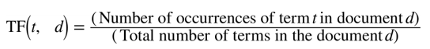
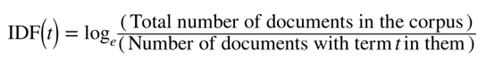
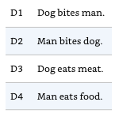
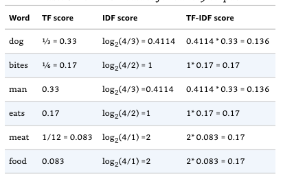
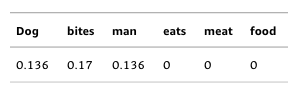
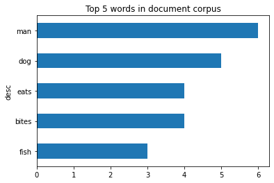
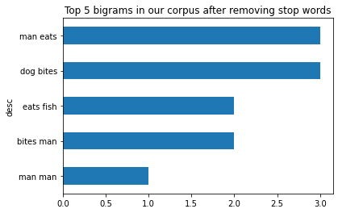
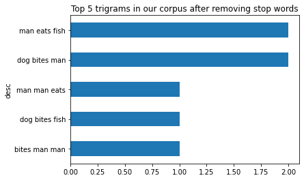
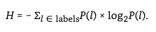

# NLP Cheat Sheet - Introduction - Overview - Python - Starter Kit

Introduction to Natural Language Processing (NLP) tools, frameworks, concepts, resources for Python

[](https://colab.research.google.com/github/janlukasschroeder/nlp-cheat-sheet-python/blob/master/NLP-Cheat-Sheet.ipynb)

# NLP Python Libraries

- [🤗 Models & Datasets](https://huggingface.co/) - includes all state-of-the models like BERT and datasets like CNN news
- [spacy](https://spacy.io/) - NLP library with out-of-the box Named Entity Recognition, POS tagging, tokenizer and more
- [NLTK](https://www.nltk.org/) - similar to spacy, simple GUI model download `nltk.download()`
- [gensim](https://radimrehurek.com/gensim) - topic modelling, accessing corpus, similarity calculations between query and indexed docs, SparseMatrixSimilarity, Latent Semantic Analysis
- [lexnlp](https://github.com/LexPredict/lexpredict-lexnlp) - information retrieval and extraction for real, unstructured legal text
- [Holmes](https://github.com/msg-systems/holmes-extractor#the-basic-idea) - information extraction, document classification, search in documents
- [fastText](https://fasttext.cc/) - library for efficient text classification and representation learning

# NLP Tasks

## Text Generation

- Text summarization, e.g. summarize an earnings call
- Question answering, e.g. a chatbot answering simple customer questions
- Google Ads copy generator, e.g. provide a text to the model for it to generate a Google Ad copy
- Translation
- Synonym finder

## Text Classifcation

- Sentiment analysis, e.g. assign sentiment (`positive`, `neutral`, `negative`) to a product review
- Support ticket classification, e.g. assign classes (`bug`, `feature request`) to a customer support ticket
- Document classification, e.g. find articles matching a search query
- Fact checking

## In-Text Analysis

- Spell checking
- Named entity recognition
- Part-of speech tagging

# Framworks

- PyTorch is an open source machine learning library based on the Torch library, used for applications such as computer vision and natural language processing
- TensorFlow
- Keras

# NLP Algortihms/Models

- [Microsoft's Turing URL v6](https://arxiv.org/abs/2210.14867)
- [GPT-NeoX](https://github.com/EleutherAI/gpt-neox) - open source version of GPT
- [Alibaba’s StructBERT](https://github.com/alibaba/AliceMind)
- [Google's T5](https://github.com/google-research/text-to-text-transfer-transformer)
- [GPT-2](https://openai.com/blog/better-language-models/) - generate fake news, text summaries
- [BERT](https://github.com/google-research/bert)
- [FinBERT](https://github.com/ProsusAI/finBERT) - analyze sentiment of financial text
- [XLnet](https://github.com/zihangdai/xlnet)
- [ERNIE](https://github.com/PaddlePaddle/ERNIE/)

Uncased model is better unless you know that case information is important for your task (e.g., Named Entity Recognition or Part-of-Speech tagging)

# Datasets

- [Gutenberg Corpus](https://block.pglaf.org/germany.shtml) - contains 25,000 free electronic books. `from nltk.corpus import gutenberg`
- [OntoNotes 5](https://github.com/ontonotes/conll-formatted-ontonotes-5.0) - corpus comprising various genres of text (news, conversational telephone speech, weblogs, usenet newsgroups, broadcast, talk shows) in three languages (English, Chinese, and Arabic) with structural information (syntax and predicate argument structure) and shallow semantics (word sense linked to an ontology and coreference).
- [wiki_en_tfidf.mm in gensim](https://radimrehurek.com/gensim/wiki.html#latent-semantic-analysis) 3.9M documents, 100K features (distinct tokens) and 0.76G non-zero entries in the sparse TF-IDF matrix. The Wikipedia corpus contains about 2.24 billion tokens in total.
- [GPT-2 Dataset](https://github.com/openai/gpt-2-output-dataset)
- [Brown corpus](http://icame.uib.no/brown/bcm-los.html) - contains text from 500 sources, and the sources have been categorized by genre, such as news, editorial, and so on.
- [Reuters Corpus - 10,788 news documents totaling 1.3 million words](https://www.nltk.org/book/ch02.html)
- [Newsfilter.io stock market news corpus](https://developers.newsfilter.io/) - contains over 4 million press releases, earnings reports, FDA drug approvals, analyst ratings, merger agreements and many more covering all US companies listed on NASDAQ, NYSE, AMEX
- [Kaggle - All the news, 143K articles](https://www.kaggle.com/snapcrack/all-the-news)
- [Kaggle - Daily news for stock market prediction](https://www.kaggle.com/aaron7sun/stocknews)
- [CNN News](https://drive.google.com/uc?export=download&id=0BwmD_VLjROrfTHk4NFg2SndKcjQ)
- [AG News - PyTorch integrated](https://pytorch.org/tutorials/beginner/text_sentiment_ngrams_tutorial.html)
- [CommonCrawl News Dataset](https://commoncrawl.org/2016/10/news-dataset-available/)

# Benchmarks

Evaluate models performance on language understanding tasks, such as question answering and text summarization.

- [Glue](https://gluebenchmark.com/leaderboard)
- [SuperGlue](https://super.gluebenchmark.com/leaderboard)

# Other Resources

[PapersWithCode](https://paperswithcode.com/task/text-classification)

# Starting with Spacy

spacy (good for beginners; use NLTK for bigger projects)

```shell
pip install spacy
python -m spacy download en
# python -m spacy download en_core_web_lg
```

LexNLP (good for dealing with legal and financial documents; [installation guide here](https://github.com/LexPredict/lexpredict-contraxsuite/blob/master/documentation/Installation%20and%20Configuration/Installation%20and%20Configuration%20Guide.pdf))

```shell
pip install https://github.com/LexPredict/lexpredict-lexnlp/archive/master.zip
python # to open REPL console
>>> import nltk
>>> nltk.download() # download all packages
```

# Concepts

---

# Word embeddings (=word vectors)

Visualizing word vectors using PCA. Paper: https://papers.nips.cc/paper/5021-distributed-representations-of-words-and-phrases-and-their-compositionality.pdf


- Word embeddings are vector representation of words.
- Example sentence: word embeddings are words converted into numbers.
- A word in this sentence may be “Embeddings” or “numbers ” etc.
- A dictionary may be the list of all unique words in the sentence, eg [‘Word’,’Embeddings’,’are’,’Converted’,’into’,’numbers’]
- A vector representation of a word may be a one-hot encoded vector where 1 stands for the position where the word exists and 0 everywhere else.

### Example

- numbers = [0,0,0,0,0,1]
- converted = [0,0,0,1,0,0]

** Either use pre-trained word vectors or train our own**

#### Pre-trained word embeddings:

- Word2Vec (Google, 2013), uses Skip Gram and CBOW
- [Vectors trained on Google News (1.5GB)](https://drive.google.com/file/d/0B7XkCwpI5KDYNlNUTTlSS21pQmM/edit) - vocabulary of 3 million words trained on around 100 billion words from the google news dataset
- GloVe (Stanford)
- [Stanford Named Entity Recognizer (NER)](https://nlp.stanford.edu/software/CRF-NER.shtml)
- [LexPredict: pre-trained word embedding models for legal or regulatory text](https://github.com/LexPredict/lexpredict-lexnlp)
- [LexNLP legal models](https://github.com/LexPredict/lexpredict-legal-dictionary) - US GAAP, finaical common terms, US federal regulators, common law

#### Create word vectors yourself

```python
import gensim
word2vev_model = gensim.models.word2vec.Word2Vec(sentence_list)
```

https://www.analyticsvidhya.com/blog/2017/06/word-embeddings-count-word2veec/

## How to create word vectors?

- Count-based methods compute the statistics of how often some word co-occurs with its neighbor words in a large text corpus, and then map these count-statistics down to a small, dense vector for each word.
- Predictive models directly try to predict a word from its neighbors in terms of learned small, dense embedding vectors (considered parameters of the model).
  - Example: Word2vec (Google)

### 1. Count based word embeddings

#### Count Vector (= Document Term Matrix)


#### TF-IDF

Term Frequency - Inverse Document Frequency

- Term frequency (TF) is the number of times a word appears in a document divided by the total number of words in the document.
- Inverse document frequency (IDF) = importance of the term across a corpus. It calculates the weight of rare words in all documents in the corpus, with rare words having a high IDF score, and words that are present in all documents (e.g. `a`, `the`, `is`) having IDF close to zero.

(sklearn) in Python has a function TfidfVectorizer() that will compute the TF-IDF values for you.





The TF-IDF score is a product of these two terms. Thus,

```
TF-IDF score = TF * IDF
```

##### Example 1

The document size of our corpus is N=4.



The TF-IDF values for each term are:



The TF-IDF vector representation for a document is then simply the TF-IDF scrore for each term in that document.

So, for document D1 we get



##### Example 2

Consider a document containing 100 words wherein the word cat appears 3 times. The term frequency (TF) for cat is then (3 / 100) = 0.03.

Now, assume we have 10 million documents and the word cat appears in one thousand of these. Then, the inverse document frequency (IDF) is calculated as log(10,000,000 / 1,000) = 4.

Thus, the Tf-idf weight is the product of these quantities: 0.03 \* 4 = 0.12

#### TD-IDF Implementation in Python

```python
from sklearn.feature_extraction.text import TfidfVectorizer

document_corpus = [
  "Dog bites man",
  "Man bites dog",
  "Dog eats meat",
  "Man eats food"
]

tfidf = TfidfVectorizer()
bow_rep_tfidf = tfidf.fit_transform(document_corpus)

print("IDF for all words in the vocabulary")
print(tfidf.idf_)
print("\nAll words in the vocabulary.")
print(tfidf.get_feature_names_out())

temp = tfidf.transform(["Dog bites man"])

print("\nTF-IDF representation for 'Dog bites man':\n", temp.toarray())
```

    IDF for all words in the vocabulary
    [1.51082562 1.22314355 1.51082562 1.91629073 1.22314355 1.91629073]

    All words in the vocabulary.
    ['bites' 'dog' 'eats' 'food' 'man' 'meat']

    TF-IDF representation for 'Dog bites man':
     [[0.65782931 0.53256952 0.         0.         0.53256952 0.        ]]

Notice that the TF-IDF scores that we calculated for our corpus doesn't match the TF-IDF scores given by scikit-learn. This is because scikit-learn uses a slightly modified version of the IDF formula. This stems from provisions to account for possible zero divisions and to not entirely ignore terms that appear in all documents.

TD-IDF with N-Gram

```python
from sklearn.feature_extraction.text import TfidfVectorizer
import re

document_corpus = [
  "Dog bites man",
  "Man bites dog",
  "Dog eats meat",
  "Man eats food"
]

# Write a function for cleaning strings and returning an array of ngrams
def ngrams_analyzer(string):
    string = re.sub(r'[,-./]', r'', string)
    ngrams = zip(*[string[i:] for i in range(5)])  # N-Gram length is 5
    return [''.join(ngram) for ngram in ngrams]

# Construct your vectorizer for building the TF-IDF matrix
tfidf = TfidfVectorizer(analyzer=ngrams_analyzer)

bow_rep_tfidf = tfidf.fit_transform(document_corpus)

print("IDF for all words in the vocabulary")
print(tfidf.idf_)
print("\nAll words in the vocabulary.")
print(tfidf.get_feature_names_out())

temp = tfidf.transform(["Dog bites man"])

print("\nTF-IDF representation for 'Dog bites man':\n", temp.toarray())

# Credits: https://towardsdatascience.com/group-thousands-of-similar-spreadsheet-text-cells-in-seconds-2493b3ce6d8d
```

    IDF for all words in the vocabulary
    [1.51082562 1.51082562 1.91629073 1.91629073 1.91629073 1.91629073
     1.91629073 1.91629073 1.91629073 1.91629073 1.91629073 1.91629073
     1.51082562 1.51082562 1.91629073 1.91629073 1.91629073 1.91629073
     1.51082562 1.91629073 1.91629073 1.91629073 1.91629073 1.91629073
     1.91629073 1.91629073 1.91629073 1.91629073 1.91629073 1.91629073
     1.91629073]

    All words in the vocabulary.
    [' bite' ' eats' ' food' ' meat' 'Dog b' 'Dog e' 'Man b' 'Man e' 'an bi'
     'an ea' 'ats f' 'ats m' 'bites' 'eats ' 'es do' 'es ma' 'g bit' 'g eat'
     'ites ' 'n bit' 'n eat' 'og bi' 'og ea' 's dog' 's foo' 's man' 's mea'
     'tes d' 'tes m' 'ts fo' 'ts me']

    TF-IDF representation for 'Dog bites man':
     [[0.28113163 0.         0.         0.         0.35657982 0.
      0.         0.         0.         0.         0.         0.
      0.28113163 0.         0.         0.35657982 0.35657982 0.
      0.28113163 0.         0.         0.35657982 0.         0.
      0.         0.35657982 0.         0.         0.35657982 0.
      0.        ]]

#### Co-Occurrence Vector/Matrix

Words that are similar to each other will tend to co-occur together.

Let’s call the context of the word, the two words that surround a specific word by each side. For example, in a sentence `I ate a peach yesterday`, the word `peach` is surrounded by the words: `ate`, `a`, `yesterday`.

To build a co-occurrence matrix, one has to start with the full vocabulary of words in a specific corpus.

**Example**

Let’s imagine some simple sentences:

- I’m riding in my car to the beach.
- I’m riding in my jeep to the beach.
- My car is a jeep.
- My jeep is a car.
- I ate a banana.
- I ate a peach.

The vocabulary of our group of sentences is:

`a, ate, banana, beach, car, in, is, I’m, jeep, my, riding, to, the`

Our co-occurence vector will be of of size 13, where 13 is the number of distinct words in our vocabulary.

The initialized co-occurence vector for the word `car` is:

`[0, 0, 0, 0, 0, 0, 0, 0, 0, 0, 0, 0, 0]`

In our sentences, the word `car` shows up in 3 sentences:

- I’m riding **in my** car **to the** beach.
- **My** car **is a** jeep.
- My jeep **is a** car.

The highlighted words co-occur with the word `car`, i.e. the highlights represent the two words before and two words after `car`.

The co-occurence vector for `car` is:

```
# Vocabulary + co-occurence vector below
 a, ate, banana, beach, car, in, is, I’m, jeep, my, riding, to, the
[2,   0,      0,     0,   0,  1,  2,   0,    0,  2,      0,  1,   1]
```

Each number represents the number of occurences in the context of the word. For example, `a` appears twice, whereas `ate` didn't appear at all.

[Credits](https://towardsdatascience.com/word-vectors-intuition-and-co-occurence-matrixes-a7f67cae16cd)

### 2. Prediction based word embeddings

- Uses Neural Networks
- CBOW predicts target words (e.g. 'mat') from source context words ('the cat sits on the')
- Skip-gram does the inverse and predicts source context-words from the target words

#### CBOW (Continuous Bag of words)


#### Skip Gram

Skip – gram follows the same topology as of CBOW. It just flips CBOW’s architecture on its head. The aim of skip-gram is to predict the context given a word


#### Outcome


## Bag of Words

```python
# John likes to watch movies. Mary likes movies too.
BoW1 = {"John":1,"likes":2,"to":1,"watch":1,"movies":2,"Mary":1,"too":1};
```

# spacy

```python
import spacy
```

```python
# Import dataset
nlp = spacy.load("en")
# Import large dataset. Needs to be downloaded first.
# nlp = spacy.load("en_core_web_lg")
```

# Stop Words

Stop words are the very common words like ‘if’, ‘but’, ‘we’, ‘he’, ‘she’, and ‘they’.
We can usually remove these words without changing the semantics of a text and doing so often (but not always) improves the performance of a model.

```python
# spacy: Removing stop words
spacy_stopwords = spacy.lang.en.stop_words.STOP_WORDS

print('spacy: Number of stop words: %d' % len(spacy_stopwords))
```

    spacy: Number of stop words: 326

```python
# nltk: Removing stop words
from nltk.corpus import stopwords
english_stop_words = stopwords.words('english')

print('ntlk: Number of stop words: %d' % len(english_stop_words))
```

    ntlk: Number of stop words: 179

```python
text = 'Larry Page founded Google in early 1990.'
doc = nlp(text)
tokens = [token.text for token in doc if not token.is_stop]
print('Original text: %s' % (text))
print()
print(tokens)
```

    Original text: Larry Page founded Google in early 1990.

    ['Larry', 'Page', 'founded', 'Google', 'early', '1990', '.']

# Spans

Part of a given text. So doc[2:4] is a span starting at token 2, up to – but not including! – token 4.

Docs: https://spacy.io/api/span

```python
doc = nlp("Larry Page founded Google in early 1990.")
span = doc[2:4]
span.text
```

    'founded Google'

```python
[(spans) for spans in doc]
```

    [Larry, Page, founded, Google, in, early, 1990, .]

# Token and Tokenization

Segmenting text into words, punctuation etc.

- Sentence tokenization
- Word tokenization

Docs: https://spacy.io/api/token

```python
doc = nlp("Larry Page founded Google in early 1990.")
[token.text for token in doc]
```

    ['Larry', 'Page', 'founded', 'Google', 'in', 'early', '1990', '.']

```python
# Load OpenAI GPT-2 using PyTorch Transformers
tokenizer = GPT2Tokenizer.from_pretrained('gpt2')
model = GPT2Model.from_pretrained('gpt2')
# https://huggingface.co/pytorch-transformers/serialization.html
```

# Tokenizers

- Byte-Pair Encoding (used by GPT-2)
- WordPiece (used by BERT)
- Unigram (used by T5)

[SentencePiece](https://github.com/google/sentencepiece) is a tokenization algorithm for the preprocessing of text.

[Unicode normalization](http://www.unicode.org/reports/tr15/) (such as NFC or NFKC), can also be applied by tokenizer.

HTML tokenizers

- by W3: https://www.w3.org/TR/2011/WD-html5-20110113/tokenization.html
- by spact: https://pypi.org/project/spacy-html-tokenizer/

## Tokenization Process


[Credits](https://huggingface.co/course/chapter6/4?fw=pt)

# Chunks and Chunking

Segments and labels multi-token sequences.

- Each of these larger boxes is called a chunk.
- Like tokenization, which omits whitespace, chunking usually selects a subset of the tokens.
- The pieces produced by a chunker do not overlap in the source text.


<center>Segmentation and Labeling at both the Token and Chunk Levels</center>


<center>Tag Representation of Chunk Structures</center>


<center>Tree Representation of Chunk Structures</center>

Credits: https://www.nltk.org/book/ch07.html

# Chinks and Chinking

Chink is a sequence of tokens that is not included in a chunk.

Credits: https://www.nltk.org/book/ch07.html

# Part-of-speech (POS) Tagging

Assigning word types to tokens like verb or noun.

POS tagging should be done straight after tokenization and before any words are removed so that sentence structure is preserved and it is more obvious what part of speech the word belongs to.

```python
text = "Asian shares skidded on Tuesday after a rout in tech stocks put Wall Street to the sword"
doc = nlp(text)
[(x.orth_, x.pos_, spacy.explain(x.pos_)) for x in [token for token in doc]]
```

    [('Asian', 'ADJ', 'adjective'),
     ('shares', 'NOUN', 'noun'),
     ('skidded', 'VERB', 'verb'),
     ('on', 'ADP', 'adposition'),
     ('Tuesday', 'PROPN', 'proper noun'),
     ('after', 'ADP', 'adposition'),
     ('a', 'DET', 'determiner'),
     ('rout', 'NOUN', 'noun'),
     ('in', 'ADP', 'adposition'),
     ('tech', 'NOUN', 'noun'),
     ('stocks', 'NOUN', 'noun'),
     ('put', 'VERB', 'verb'),
     ('Wall', 'PROPN', 'proper noun'),
     ('Street', 'PROPN', 'proper noun'),
     ('to', 'ADP', 'adposition'),
     ('the', 'DET', 'determiner'),
     ('sword', 'NOUN', 'noun')]

```python
[(x.orth_, x.tag_, spacy.explain(x.tag_)) for x in [token for token in doc]]
```

    [('Asian', 'JJ', 'adjective'),
     ('shares', 'NNS', 'noun, plural'),
     ('skidded', 'VBD', 'verb, past tense'),
     ('on', 'IN', 'conjunction, subordinating or preposition'),
     ('Tuesday', 'NNP', 'noun, proper singular'),
     ('after', 'IN', 'conjunction, subordinating or preposition'),
     ('a', 'DT', 'determiner'),
     ('rout', 'NN', 'noun, singular or mass'),
     ('in', 'IN', 'conjunction, subordinating or preposition'),
     ('tech', 'NN', 'noun, singular or mass'),
     ('stocks', 'NNS', 'noun, plural'),
     ('put', 'VBD', 'verb, past tense'),
     ('Wall', 'NNP', 'noun, proper singular'),
     ('Street', 'NNP', 'noun, proper singular'),
     ('to', 'IN', 'conjunction, subordinating or preposition'),
     ('the', 'DT', 'determiner'),
     ('sword', 'NN', 'noun, singular or mass')]

```python
# using nltk
import nltk

tokens = nltk.word_tokenize(text)
pos_tags = nltk.pos_tag(tokens)
pos_tags
```

    [('Asian', 'JJ'),
     ('shares', 'NNS'),
     ('skidded', 'VBN'),
     ('on', 'IN'),
     ('Tuesday', 'NNP'),
     ('after', 'IN'),
     ('a', 'DT'),
     ('rout', 'NN'),
     ('in', 'IN'),
     ('tech', 'JJ'),
     ('stocks', 'NNS'),
     ('put', 'VBD'),
     ('Wall', 'NNP'),
     ('Street', 'NNP'),
     ('to', 'TO'),
     ('the', 'DT'),
     ('sword', 'NN')]

## BILUO tagging

- BEGIN - The first token of a multi-token entity.
- IN - An inner token of a multi-token entity.
- LAST - The final token of a multi-token entity.
- UNIT - A single-token entity.
- OUT - A non-entity token.

```python
[(token, token.ent_iob_, token.ent_type_) for token in doc]
```

    [(Asian, 'B', 'NORP'),
     (shares, 'O', ''),
     (skidded, 'O', ''),
     (on, 'O', ''),
     (Tuesday, 'B', 'DATE'),
     (after, 'O', ''),
     (a, 'O', ''),
     (rout, 'O', ''),
     (in, 'O', ''),
     (tech, 'O', ''),
     (stocks, 'O', ''),
     (put, 'O', ''),
     (Wall, 'O', ''),
     (Street, 'O', ''),
     (to, 'O', ''),
     (the, 'O', ''),
     (sword, 'O', '')]

# Stemming

Stemming is the process of reducing words to their root form.

Examples:

- cats, catlike, catty → cat
- fishing, fished, fisher → fish

There are two types of stemmers in NLTK: [Porter Stemmer](https://tartarus.org/martin/PorterStemmer/) and [Snowball stemmers](https://tartarus.org/martin/PorterStemmer/)

[Credits](https://stackabuse.com/python-for-nlp-tokenization-stemming-and-lemmatization-with-spacy-library/)

```python
import nltk
from nltk.stem.porter import *

stemmer = PorterStemmer()
tokens = ['compute', 'computer', 'computed', 'computing']
for token in tokens:
    print(token + ' --> ' + stemmer.stem(token))
```

    compute --> comput
    computer --> comput
    computed --> comput
    computing --> comput

# Lemmatization

Assigning the base form of word, for example:

- "was" → "be"
- "rats" → "rat"

```python
doc = nlp("Was Google founded in early 1990?")
[(x.orth_, x.lemma_) for x in [token for token in doc]]
```

    [('Was', 'be'),
     ('Google', 'Google'),
     ('founded', 'found'),
     ('in', 'in'),
     ('early', 'early'),
     ('1990', '1990'),
     ('?', '?')]

# Sentence Detection

Finding and segmenting individual sentences.

```python
doc = nlp("Larry Page founded Google in early 1990. Sergey Brin joined.")
[sent.text for sent in doc.sents]
```

    ['Larry Page founded Google in early 1990.', 'Sergey Brin joined.']

# Dependency Parsing

Assigning syntactic dependency labels, describing the relations between individual tokens, like subject or object.

```python
doc = nlp("We are reading a text.")
# Dependency labels
[(x.orth_, x.dep_, spacy.explain(x.dep_)) for x in [token for token in doc]]
```

    [('We', 'nsubj', 'nominal subject'),
     ('are', 'aux', 'auxiliary'),
     ('reading', 'ROOT', None),
     ('a', 'det', 'determiner'),
     ('text', 'dobj', 'direct object'),
     ('.', 'punct', 'punctuation')]

```python
# Syntactic head token (governor)
[token.head.text for token in doc]
```

    ['reading', 'reading', 'reading', 'text', 'reading', 'reading']

# Base noun phrases

```python
doc = nlp("I have a red car")
[chunk.text for chunk in doc.noun_chunks]
```

    ['I', 'a red car']

# Named Entity Recognition (NER)

What is NER? Labeling "real-world" objects, like persons, companies or locations.

2 popular approaches:

- Rule-based
- ML-based:
  - Multi-class classification
  - Conditional Random Field (probabilistic graphical model)

Datasets:

- [Kaggle, IOB, POS tags](https://www.kaggle.com/abhinavwalia95/entity-annotated-corpus/home)

Credits: https://medium.com/@yingbiao/ner-with-bert-in-action-936ff275bc73

Entities supported by spacy:

- PERSON People, including fictional.
- NORP Nationalities or religious or political groups.
- FAC Buildings, airports, highways, bridges, etc.
- ORG Companies, agencies, institutions, etc.
- GPE Countries, cities, states.
- LOC Non-GPE locations, mountain ranges, bodies of water.
- PRODUCT Objects, vehicles, foods, etc. (Not services.)
- EVENT Named hurricanes, battles, wars, sports events, etc.
- WORK_OF_ART Titles of books, songs, etc.
- LAW Named documents made into laws.
- LANGUAGE Any named language.
- DATE Absolute or relative dates or periods.
- TIME Times smaller than a day.
- PERCENT Percentage, including ”%“.
- MONEY Monetary values, including unit.
- QUANTITY Measurements, as of weight or distance.
- ORDINAL “first”, “second”, etc.
- CARDINAL Numerals that do not fall under another type.

## Alternatives to spacy

[LexNLP](https://lexpredict-lexnlp.readthedocs.io/en/latest/modules/extract/extract.html#pattern-based-extraction-methods) entities:

- acts, e.g., “section 1 of the Advancing Hope Act, 1986”
- amounts, e.g., “ten pounds” or “5.8 megawatts”
- citations, e.g., “10 U.S. 100” or “1998 S. Ct. 1”
- companies, e.g., “Lexpredict LLC”
- conditions, e.g., “subject to …” or “unless and until …”
- constraints, e.g., “no more than” or “
- copyright, e.g., “(C) Copyright 2000 Acme”
- courts, e.g., “Supreme Court of New York”
- CUSIP, e.g., “392690QT3”
- dates, e.g., “June 1, 2017” or “2018-01-01”
- definitions, e.g., “Term shall mean …”
- distances, e.g., “fifteen miles”
- durations, e.g., “ten years” or “thirty days”
- geographic and geopolitical entities, e.g., “New York” or “Norway”
- money and currency usages, e.g., “$5” or “10 Euro”
- percents and rates, e.g., “10%” or “50 bps”
- PII, e.g., “212-212-2121” or “999-999-9999”
- ratios, e.g.,” 3:1” or “four to three”
- regulations, e.g., “32 CFR 170”
- trademarks, e.g., “MyApp (TM)”
- URLs, e.g., “http://acme.com/”

Stanford NER entities:

- Location, Person, Organization, Money, Percent, Date, Time

NLTK

- NLTK maximum entropy classifier

Transformer Models (on HuggingFace)

- [GPT-NeoX](https://github.com/EleutherAI/gpt-neox)
- [BERT](https://huggingface.co/dslim/bert-base-NER?text=My+name+is+Sarah+and+I+live+in+London)
- [BERT-large](https://huggingface.co/dslim/bert-large-NER)
- [camemBERT](https://huggingface.co/Jean-Baptiste/camembert-ner)
- [Electra](https://huggingface.co/dbmdz/electra-large-discriminator-finetuned-conll03-english)
- [NER-English-Large](https://huggingface.co/flair/ner-english-large) (best so far for org NER)
- [XML-RoBERTa](https://huggingface.co/xlm-roberta-large-finetuned-conll03-english)

```python
doc = nlp("Larry Page founded Google in the US in early 1990.")
# Text and label of named entity span
[(ent.text, ent.label_) for ent in doc.ents]
```

    [('Larry Page', 'PERSON'),
     ('Google', 'ORG'),
     ('US', 'GPE'),
     ('early 1990', 'DATE')]

```python
doc = nlp('European authorities fined Google a record $5.1 billion on Wednesday for abusing its power in the mobile phone market and ordered the company to alter its practices')
[(X.text, X.label_) for X in doc.ents]
```

    [('European', 'NORP'),
     ('Google', 'ORG'),
     ('$5.1 billion', 'MONEY'),
     ('Wednesday', 'DATE')]

```python
from collections import Counter

labels = [x.label_ for x in doc.ents]
Counter(labels)
```

    Counter({'NORP': 1, 'ORG': 1, 'MONEY': 1, 'DATE': 1})

```python
[(X, X.ent_iob_, X.ent_type_) for X in doc]
```

    [(European, 'B', 'NORP'),
     (authorities, 'O', ''),
     (fined, 'O', ''),
     (Google, 'B', 'ORG'),
     (a, 'O', ''),
     (record, 'O', ''),
     ($, 'B', 'MONEY'),
     (5.1, 'I', 'MONEY'),
     (billion, 'I', 'MONEY'),
     (on, 'O', ''),
     (Wednesday, 'B', 'DATE'),
     (for, 'O', ''),
     (abusing, 'O', ''),
     (its, 'O', ''),
     (power, 'O', ''),
     (in, 'O', ''),
     (the, 'O', ''),
     (mobile, 'O', ''),
     (phone, 'O', ''),
     (market, 'O', ''),
     (and, 'O', ''),
     (ordered, 'O', ''),
     (the, 'O', ''),
     (company, 'O', ''),
     (to, 'O', ''),
     (alter, 'O', ''),
     (its, 'O', ''),
     (practices, 'O', '')]

```python
# Show Begin and In entities
items = [x.text for x in doc.ents]
print(items)
Counter(items).most_common(3)
```

    ['European', 'Google', '$5.1 billion', 'Wednesday']


    [('European', 1), ('Google', 1), ('$5.1 billion', 1)]

```python
import lexnlp.extract.en as lexnlp
import nltk
```

```python
text = "There are ten cows in the 2 acre pasture."
print(list(lexnlp.amounts.get_amounts(text)))
```

    [10, 2.0]

```python
import lexnlp.extract.en.acts
text = "test section 12 of the VERY Important Act of 1954."
lexnlp.extract.en.acts.get_act_list(text)
```

    [{'location_start': 5,
      'location_end': 49,
      'act_name': 'VERY Important Act',
      'section': '12',
      'year': '1954',
      'ambiguous': False,
      'value': 'section 12 of the VERY Important Act of 1954'}]

## NER with flair's NER-English-Large

Source: https://huggingface.co/flair/ner-english-large

Available tags:

- PER, person
- LOC, location
- ORG, organization
- MISC, other name

```python
pip install flair
```

```python
from flair.data import Sentence
from flair.models import SequenceTagger

# load tagger
tagger = SequenceTagger.load("flair/ner-english-large")
```

```python
# make example sentence
sentence = Sentence("George Washington went to Washington")

# predict NER tags
tagger.predict(sentence)

# print sentence
print(sentence)

# print predicted NER spans
print('The following NER tags are found:')

# iterate over entities and print
for entity in sentence.get_spans('ner'):
    print(entity)
```

    Sentence: "George Washington went to Washington" → ["George Washington"/PER, "Washington"/LOC]
    The following NER tags are found:
    Span[0:2]: "George Washington" → PER (1.0)
    Span[4:5]: "Washington" → LOC (1.0)

```python
text = "We are the platform of choice for customers' SAP workloads in the cloud, companies like Thabani, Munich Re's, Sodexo, Volvo Cars, all run SAP on Azure. We are the only cloud provider with direct and secure access to Oracle databases running an Oracle Cloud infrastructure, making it possible for companies like FedEx, GE, and Marriott to use capabilities from both companies. And with Azure Confidential Computing, we're enabling companies in highly regulated industries, including RBC, to bring their most sensitive applications to the cloud. Just last week, UBS said it will move more than 50% of its applications to Azure."

# make example sentence
sentence = Sentence(text)

# predict NER tags
tagger.predict(sentence)

# print sentence
print(sentence)

# print predicted NER spans
print('\nThe following NER tags are found:\n')

# iterate over entities and print
for entity in sentence.get_spans('ner'):
    print(entity)
```

    Sentence: "We are the platform of choice for customers' SAP workloads in the cloud , companies like Thabani , Munich Re 's , Sodexo , Volvo Cars , all run SAP on Azure . We are the only cloud provider with direct and secure access to Oracle databases running an Oracle Cloud infrastructure , making it possible for companies like FedEx , GE , and Marriott to use capabilities from both companies . And with Azure Confidential Computing , we 're enabling companies in highly regulated industries , including RBC , to bring their most sensitive applications to the cloud . Just last week , UBS said it will move more than 50 % of its applications to Azure ." → ["SAP"/ORG, "Thabani"/ORG, "Munich Re"/ORG, "Sodexo"/ORG, "Volvo Cars"/ORG, "SAP"/ORG, "Azure"/MISC, "Oracle"/ORG, "Oracle Cloud"/MISC, "FedEx"/ORG, "GE"/ORG, "Marriott"/ORG, "Azure Confidential Computing"/MISC, "RBC"/ORG, "UBS"/ORG, "Azure"/MISC]

    The following NER tags are found:

    Span[8:9]: "SAP" → ORG (0.9945)
    Span[16:17]: "Thabani" → ORG (1.0)
    Span[18:20]: "Munich Re" → ORG (0.9604)
    Span[22:23]: "Sodexo" → ORG (1.0)
    Span[24:26]: "Volvo Cars" → ORG (1.0)
    Span[29:30]: "SAP" → ORG (0.9995)
    Span[31:32]: "Azure" → MISC (0.9974)
    Span[45:46]: "Oracle" → ORG (0.9997)
    Span[49:51]: "Oracle Cloud" → MISC (1.0)
    Span[59:60]: "FedEx" → ORG (1.0)
    Span[61:62]: "GE" → ORG (1.0)
    Span[64:65]: "Marriott" → ORG (1.0)
    Span[74:77]: "Azure Confidential Computing" → MISC (0.999)
    Span[88:89]: "RBC" → ORG (1.0)
    Span[104:105]: "UBS" → ORG (1.0)
    Span[117:118]: "Azure" → MISC (0.9993)

# Text Classification

Two types:

- binary classification (text only belongs to one class)
- multi-class classification (text can belong to multiple classes)

Assigning categories or labels to a whole document, or parts of a document.

Approach:

- calculate document vectors for each document
- use kNN to calculate clusters based on document vectors
- each cluster represents a class of documents that are similar to each other

```python
# Credits: https://pytorch.org/tutorials/beginner/text_sentiment_ngrams_tutorial.html
import re
from torchtext.data.utils import ngrams_iterator
from torchtext.data.utils import get_tokenizer

ag_news_label = {1 : "World",
                 2 : "Sports",
                 3 : "Business",
                 4 : "Sci/Tec"}

def predict(text, model, vocab, ngrams):
    tokenizer = get_tokenizer("basic_english")
    with torch.no_grad():
        text = torch.tensor([vocab[token]
                            for token in ngrams_iterator(tokenizer(text), ngrams)])
        output = model(text, torch.tensor([0]))
        return output.argmax(1).item() + 1

ex_text_str = "MEMPHIS, Tenn. – Four days ago, Jon Rahm was \
    enduring the season’s worst weather conditions on Sunday at The \
    Open on his way to a closing 75 at Royal Portrush, which \
    considering the wind and the rain was a respectable showing. \
    Thursday’s first round at the WGC-FedEx St. Jude Invitational \
    was another story. With temperatures in the mid-80s and hardly any \
    wind, the Spaniard was 13 strokes better in a flawless round. \
    Thanks to his best putting performance on the PGA Tour, Rahm \
    finished with an 8-under 62 for a three-stroke lead, which \
    was even more impressive considering he’d never played the \
    front nine at TPC Southwind."

vocab = train_dataset.get_vocab()
model = model.to("cpu")

print("This is a %s news" %ag_news_label[predict(ex_text_str, model, vocab, 2)])

# Output: This is a Sports news
```

## CountVectorizer

- Convert a collection of text documents to a matrix of token counts
- [skikitLearn](https://scikit-learn.org/stable/modules/generated/sklearn.feature_extraction.text.CountVectorizer.html)

# Similarity

How similar are two documents, sentences, token or spans?

Popular: [Cosine](https://studymachinelearning.com/cosine-similarity-text-similarity-metric/) and [Jaccard](https://studymachinelearning.com/jaccard-similarity-text-similarity-metric-in-nlp/) similarity.

**Cosine similarity** (also known as: L2-normalized dot product of vectors) is a formula used to calculate how similar two given word vectors are.

**Jaccard similarity** indicates how many words two documents share by using the intersection and unions of the words.

**Levenshtein distance** is a metric for measuring the difference between two sequences. How similar are two words, or how similar are two sentences?

## Cosine Similarity

A document, sentence or word is represented as a vector and the Cosine sim calculates the angle (="similarity") between two vectors.

The resulting similarity ranges from:

- 1 if the vectors are the same
- 0 if the vectors don’t have any relationship (orthogonal vectors)


Similarity measurements for:

- Term frequency vectors (bag of words)
- TF-IDF vectors
- Oc-occurence vectors

### Example 1

Figure below shows three word vectors and Cosine distance (=similarity) between

- "I hate cats" and "I love dogs" (result: not very similar)
- "I love dogs" and "I love, love, love, .. dogs" (result: similar)


[Credits](https://towardsdatascience.com/group-thousands-of-similar-spreadsheet-text-cells-in-seconds-2493b3ce6d8d)

### Example 2

```
doc_1 = "Data is the oil of the digital economy"
doc_2 = "Data is a new oil"

# Vector representation of the document
doc_1_vector = [1, 1, 1, 1, 0, 1, 1, 2]
doc_2_vector = [1, 0, 0, 1, 1, 0, 1, 0]
```


[Credits](https://studymachinelearning.com/cosine-similarity-text-similarity-metric/)

---

Cosine sim with scikit: [sklearn.metrics.pairwise.cosine_similarity](https://scikit-learn.org/stable/modules/generated/sklearn.metrics.pairwise.cosine_similarity.html#sklearn.metrics.pairwise.cosine_similarity)

## Jaccard Similarity

Jaccard sim is calculated by dividing the number of words occuring in both documents/sentences (intersection) with the number of all words in both docs/sents (union).

### Example

```
doc_1 = "Data is the new oil of the digital economy"
doc_2 = "Data is a new oil"
```

Each sentence is tokenized into words.

```
words_doc1 = {'data', 'is', 'the', 'new', 'oil', 'of', 'digital', 'economy'}
words_doc2 = {'data', 'is', 'a', 'new', 'oil'}
```

Four words occur in both sentences (intersection): data, is, new, oil.

Across both sentences, nine unique words exist (union): data, a, of, is, economy, the, new, digital, oil.


Visualized:


## Levenshtein Distance

Levenshtein distance between two words is the minimum number of single-character edits (i.e. insertions, deletions or substitutions) required to change one word into the other.

The distance can also be calculated for sentences, i.e. the minimum number of single token edits required to change one sentence into the other.

Levenshtein distance for two strings `a`, `b` of length `|a|` and `|b|` is given by `lev`:


### Example 1

Levenshtein distance between `HONDA` and `HYUNDAI` is 3 because it takes three transformations to change `HONDA` to `HYUNDAI`:

1. Add `Y` to `HONDA` => `HYONDA`
2. Substitue `O` with `U` in `HYONDA` => `HYUNDA`
3. Add `I` to `HYUNDA` => `HYUNDAI`

### Example 2

Lev distance between two sentences `I love cats` and `I love dogs` is 1.

Step 1: tokenize both sentences to `["I", "love", "cats"]`, `["I", "love", "docs"]`

Step 2: perform one transformation, i.e. replace `cats` with `dogs`.

## L2 Norm

Length of a word vector. Also known as **Euclidean norm**.

Example:

- length of "I like cats" is 4.7

```python
doc1 = nlp("I like cats")
doc2 = nlp("I like dogs")
# Compare 2 documents
doc1.similarity(doc2)
```

    0.957709143352323

```python
# "cats" vs "dogs"
doc1[2].similarity(doc2[2])
```

    0.83117634

```python
# "I" vs "like dogs"
doc1[0].similarity(doc2[1:3])
```

    0.46475163

```python
doc = nlp("I like cats")
# L2 norm of "I like cats"
doc.vector_norm
```

    4.706799587675896

```python
# L2 norm of "cats"
doc[2].vector_norm
```

    6.933004

```python
# Vector representation of "cats"
doc[2].vector
```

    array([-0.26763  ,  0.029846 , -0.3437   , -0.54409  , -0.49919  ,
            0.15928  , -0.35278  , -0.2036   ,  0.23482  ,  1.5671   ,
           -0.36458  , -0.028713 , -0.27053  ,  0.2504   , -0.18126  ,
            0.13453  ,  0.25795  ,  0.93213  , -0.12841  , -0.18505  ,
           -0.57597  ,  0.18538  , -0.19147  , -0.38465  ,  0.21656  ,
           -0.4387   , -0.27846  , -0.41339  ,  0.37859  , -0.2199   ,
           -0.25907  , -0.019796 , -0.31885  ,  0.12921  ,  0.22168  ,
            0.32671  ,  0.46943  , -0.81922  , -0.20031  ,  0.013561 ,
           -0.14663  ,  0.14438  ,  0.0098044, -0.15439  ,  0.21146  ,
           -0.28409  , -0.4036   ,  0.45355  ,  0.12173  , -0.11516  ,
           -0.12235  , -0.096467 , -0.26991  ,  0.028776 , -0.11307  ,
            0.37219  , -0.054718 , -0.20297  , -0.23974  ,  0.86271  ,
            0.25602  , -0.3064   ,  0.014714 , -0.086497 , -0.079054 ,
           -0.33109  ,  0.54892  ,  0.20076  ,  0.28064  ,  0.037788 ,
            0.0076729, -0.0050123, -0.11619  , -0.23804  ,  0.33027  ,
            0.26034  , -0.20615  , -0.35744  ,  0.54125  , -0.3239   ,
            0.093441 ,  0.17113  , -0.41533  ,  0.13702  , -0.21765  ,
           -0.65442  ,  0.75733  ,  0.359    ,  0.62492  ,  0.019685 ,
            0.21156  ,  0.28125  ,  0.22288  ,  0.026787 , -0.1019   ,
            0.11178  ,  0.17202  , -0.20403  , -0.01767  , -0.34351  ,
            0.11926  ,  0.73156  ,  0.11094  ,  0.12576  ,  0.64825  ,
           -0.80004  ,  0.62074  , -0.38557  ,  0.015614 ,  0.2664   ,
            0.18254  ,  0.11678  ,  0.58919  , -1.0639   , -0.29969  ,
            0.14827  , -0.42925  , -0.090766 ,  0.12313  , -0.024253 ,
           -0.21265  , -0.10331  ,  0.91988  , -1.4097   , -0.0542   ,
           -0.071201 ,  0.66878  , -0.24651  , -0.46788  , -0.23991  ,
           -0.14138  , -0.038911 , -0.48678  ,  0.22975  ,  0.36074  ,
            0.13024  , -0.40091  ,  0.19673  ,  0.016017 ,  0.30575  ,
           -2.1901   , -0.55468  ,  0.26955  ,  0.63815  ,  0.42724  ,
           -0.070186 , -0.11196  ,  0.14079  , -0.022228 ,  0.070456 ,
            0.17229  ,  0.099383 , -0.12258  , -0.23416  , -0.26525  ,
           -0.088991 , -0.061554 ,  0.26582  , -0.53112  , -0.4106   ,
            0.45211  , -0.39669  , -0.43746  , -0.6632   , -0.048135 ,
            0.23171  , -0.37665  , -0.38261  , -0.29286  , -0.036613 ,
            0.25354  ,  0.49775  ,  0.3359   , -0.11285  , -0.17228  ,
            0.85991  , -0.34081  ,  0.27959  ,  0.03698  ,  0.61782  ,
            0.23739  , -0.32049  , -0.073717 ,  0.015991 , -0.37395  ,
           -0.4152   ,  0.049221 , -0.3137   ,  0.091128 , -0.38258  ,
           -0.036783 ,  0.10902  , -0.38332  , -0.74754  ,  0.016473 ,
            0.55256  , -0.29053  , -0.50617  ,  0.83599  , -0.31783  ,
           -0.77465  , -0.0049272, -0.17103  , -0.38067  ,  0.44987  ,
           -0.12497  ,  0.60263  , -0.12026  ,  0.37368  , -0.079952 ,
           -0.15785  ,  0.37684  , -0.18679  ,  0.18855  , -0.4759   ,
           -0.11708  ,  0.36999  ,  0.54134  ,  0.42752  ,  0.038618 ,
            0.043483 ,  0.31435  , -0.24491  , -0.67818  , -0.33833  ,
            0.039218 , -0.11964  ,  0.8474   ,  0.09451  ,  0.070523 ,
           -0.2806   ,  0.296    , -0.17554  , -0.41087  ,  0.70748  ,
            0.17686  ,  0.043479 , -0.31902  ,  0.64584  , -0.45268  ,
           -0.7967   ,  0.099817 , -0.1734   ,  0.11404  , -0.36809  ,
            0.12035  , -0.048582 ,  0.55945  , -0.51508  ,  0.072704 ,
            0.18106  ,  0.07802  , -0.31526  ,  0.38189  ,  0.092801 ,
           -0.044227 , -0.66154  , -0.020428 ,  0.059836 , -0.23628  ,
           -0.017592 , -0.56481  , -0.52934  , -0.16392  ,  0.077331 ,
            0.24583  , -0.32195  , -0.36811  , -0.037208 ,  0.26702  ,
           -0.57907  ,  0.46457  , -0.54636  ,  0.11855  ,  0.092475 ,
           -0.10469  ,  0.03319  ,  0.62616  , -0.33684  ,  0.045742 ,
            0.25089  ,  0.28973  ,  0.060633 , -0.4096   ,  0.39198  ,
            0.58276  ,  0.496    , -0.75881  ,  0.13655  ,  0.21704  ,
           -0.37978  , -0.54051  , -0.22813  ,  0.28393  , -0.58739  ,
            1.0472   , -0.13318  , -0.07325  ,  0.12991  , -0.44999  ],
          dtype=float32)

```python
# can also be done using sklearn's linear kernel (equivilant to cosine similarity)
```

# n-grams: Unigram, bigrams, trigrams

- Unigram = one word, eg the, and, of, hotel
- Bigrams = two consecutive words, eg the hotel, in seattle, the city
- Trigrams = three consecutive words, eg easy access to, high speed internet, the heart of

Credits: https://towardsdatascience.com/building-a-content-based-recommender-system-for-hotels-in-seattle-d724f0a32070

## Get all unigrams

```python
from sklearn.feature_extraction.text import CountVectorizer
import pandas as pd

def get_top_n_words(corpus, n=None):
    vec = CountVectorizer(stop_words='english').fit(corpus)
    bag_of_words = vec.transform(corpus)
    sum_words = bag_of_words.sum(axis=0)
    words_freq = [(word, sum_words[0, idx]) for word, idx in vec.vocabulary_.items()]
    words_freq = sorted(words_freq, key = lambda x: x[1], reverse=True)
    return words_freq[:n]

document_corpus = [
  "Dog bites man",
  "Dog bites man after man eats fish",
  "Dog bites fish",
  "Man bites dog",
  "Dog eats meat",
  "Man eats food",
  "Man eats fish"
]

common_words = get_top_n_words(document_corpus, 5) # or use df['desc']

df2 = pd.DataFrame(common_words, columns = ['desc' , 'count'])
df2.groupby('desc').sum()['count'].sort_values().plot(kind='barh', title='Top 5 words in document corpus')

```

    <matplotlib.axes._subplots.AxesSubplot at 0x7fbae1ff3510>



## Get all bigrams

```python
def get_top_n_bigram(corpus, n=None):
    vec = CountVectorizer(ngram_range=(2, 2), stop_words='english').fit(corpus)
    bag_of_words = vec.transform(corpus)
    sum_words = bag_of_words.sum(axis=0)
    words_freq = [(word, sum_words[0, idx]) for word, idx in vec.vocabulary_.items()]
    words_freq =sorted(words_freq, key = lambda x: x[1], reverse=True)
    return words_freq[:n]

document_corpus = [
  "Dog bites man",
  "Dog bites man after man eats fish",
  "Dog bites fish",
  "Man bites dog",
  "Dog eats meat",
  "Man eats food",
  "Man eats fish"
]

common_words = get_top_n_bigram(document_corpus, 5)

df4 = pd.DataFrame(common_words, columns = ['desc' , 'count'])
df4.groupby('desc').sum()['count'].sort_values().plot(kind='barh', title='Top 5 bigrams in our corpus after removing stop words')

```

    <matplotlib.axes._subplots.AxesSubplot at 0x7fbae2086950>



## Get all trigrams

```python
def get_top_n_trigram(corpus, n=None):
    vec = CountVectorizer(ngram_range=(3, 3), stop_words='english').fit(corpus)
    bag_of_words = vec.transform(corpus)
    sum_words = bag_of_words.sum(axis=0)
    words_freq = [(word, sum_words[0, idx]) for word, idx in vec.vocabulary_.items()]
    words_freq = sorted(words_freq, key = lambda x: x[1], reverse=True)
    return words_freq[:n]

document_corpus = [
  "Dog bites man",
  "Dog bites man after man eats fish",
  "Dog bites fish",
  "Man bites dog",
  "Dog eats meat",
  "Man eats food",
  "Man eats fish"
]

common_words = get_top_n_trigram(document_corpus, 5)

df6 = pd.DataFrame(common_words, columns = ['desc' , 'count'])
df6.groupby('desc').sum()['count'].sort_values().plot(kind='barh', title='Top 5 trigrams in our corpus after removing stop words')

```

    <matplotlib.axes._subplots.AxesSubplot at 0x7fbae20fb150>



# Visualization

```python
from spacy import displacy
```

```python
doc = nlp("This is a sentence")
displacy.render(doc, style="dep")
```

<svg xmlns="http://www.w3.org/2000/svg" xmlns:xlink="http://www.w3.org/1999/xlink" xml:lang="en" id="0bf72b5ccfc143b4871b353f00ec3470-0" class="displacy" width="750" height="312.0" direction="ltr" style="max-width: none; height: 312.0px; color: #000000; background: #ffffff; font-family: Arial; direction: ltr">
<text class="displacy-token" fill="currentColor" text-anchor="middle" y="222.0">
    <tspan class="displacy-word" fill="currentColor" x="50">This</tspan>
    <tspan class="displacy-tag" dy="2em" fill="currentColor" x="50">DET</tspan>
</text>

<text class="displacy-token" fill="currentColor" text-anchor="middle" y="222.0">
    <tspan class="displacy-word" fill="currentColor" x="225">is</tspan>
    <tspan class="displacy-tag" dy="2em" fill="currentColor" x="225">VERB</tspan>
</text>

<text class="displacy-token" fill="currentColor" text-anchor="middle" y="222.0">
    <tspan class="displacy-word" fill="currentColor" x="400">a</tspan>
    <tspan class="displacy-tag" dy="2em" fill="currentColor" x="400">DET</tspan>
</text>

<text class="displacy-token" fill="currentColor" text-anchor="middle" y="222.0">
    <tspan class="displacy-word" fill="currentColor" x="575">sentence</tspan>
    <tspan class="displacy-tag" dy="2em" fill="currentColor" x="575">NOUN</tspan>
</text>

<g class="displacy-arrow">
    <path class="displacy-arc" id="arrow-0bf72b5ccfc143b4871b353f00ec3470-0-0" stroke-width="2px" d="M70,177.0 C70,89.5 220.0,89.5 220.0,177.0" fill="none" stroke="currentColor"/>
    <text dy="1.25em" style="font-size: 0.8em; letter-spacing: 1px">
        <textPath xlink:href="#arrow-0bf72b5ccfc143b4871b353f00ec3470-0-0" class="displacy-label" startOffset="50%" side="left" fill="currentColor" text-anchor="middle">nsubj</textPath>
    </text>
    <path class="displacy-arrowhead" d="M70,179.0 L62,167.0 78,167.0" fill="currentColor"/>
</g>

<g class="displacy-arrow">
    <path class="displacy-arc" id="arrow-0bf72b5ccfc143b4871b353f00ec3470-0-1" stroke-width="2px" d="M420,177.0 C420,89.5 570.0,89.5 570.0,177.0" fill="none" stroke="currentColor"/>
    <text dy="1.25em" style="font-size: 0.8em; letter-spacing: 1px">
        <textPath xlink:href="#arrow-0bf72b5ccfc143b4871b353f00ec3470-0-1" class="displacy-label" startOffset="50%" side="left" fill="currentColor" text-anchor="middle">det</textPath>
    </text>
    <path class="displacy-arrowhead" d="M420,179.0 L412,167.0 428,167.0" fill="currentColor"/>
</g>

<g class="displacy-arrow">
    <path class="displacy-arc" id="arrow-0bf72b5ccfc143b4871b353f00ec3470-0-2" stroke-width="2px" d="M245,177.0 C245,2.0 575.0,2.0 575.0,177.0" fill="none" stroke="currentColor"/>
    <text dy="1.25em" style="font-size: 0.8em; letter-spacing: 1px">
        <textPath xlink:href="#arrow-0bf72b5ccfc143b4871b353f00ec3470-0-2" class="displacy-label" startOffset="50%" side="left" fill="currentColor" text-anchor="middle">attr</textPath>
    </text>
    <path class="displacy-arrowhead" d="M575.0,179.0 L583.0,167.0 567.0,167.0" fill="currentColor"/>
</g>
</svg>

```python
doc = nlp("Larry Page founded Google in the US in early 1990.")
displacy.render(doc, style="ent")
```

<div class="entities" style="line-height: 2.5; direction: ltr">
<mark class="entity" style="background: #aa9cfc; padding: 0.45em 0.6em; margin: 0 0.25em; line-height: 1; border-radius: 0.35em; box-decoration-break: clone; -webkit-box-decoration-break: clone">
    Larry Page
    <span style="font-size: 0.8em; font-weight: bold; line-height: 1; border-radius: 0.35em; text-transform: uppercase; vertical-align: middle; margin-left: 0.5rem">PERSON</span>
</mark>
 founded 
<mark class="entity" style="background: #7aecec; padding: 0.45em 0.6em; margin: 0 0.25em; line-height: 1; border-radius: 0.35em; box-decoration-break: clone; -webkit-box-decoration-break: clone">
    Google
    <span style="font-size: 0.8em; font-weight: bold; line-height: 1; border-radius: 0.35em; text-transform: uppercase; vertical-align: middle; margin-left: 0.5rem">ORG</span>
</mark>
 in the 
<mark class="entity" style="background: #feca74; padding: 0.45em 0.6em; margin: 0 0.25em; line-height: 1; border-radius: 0.35em; box-decoration-break: clone; -webkit-box-decoration-break: clone">
    US
    <span style="font-size: 0.8em; font-weight: bold; line-height: 1; border-radius: 0.35em; text-transform: uppercase; vertical-align: middle; margin-left: 0.5rem">GPE</span>
</mark>
 in 
<mark class="entity" style="background: #bfe1d9; padding: 0.45em 0.6em; margin: 0 0.25em; line-height: 1; border-radius: 0.35em; box-decoration-break: clone; -webkit-box-decoration-break: clone">
    early 1990
    <span style="font-size: 0.8em; font-weight: bold; line-height: 1; border-radius: 0.35em; text-transform: uppercase; vertical-align: middle; margin-left: 0.5rem">DATE</span>
</mark>
.</div>

Inspired by: https://www.datacamp.com/community/blog/spacy-cheatsheet

# Kernels

Used by

- Support Vector Machines (SVMs)
- Principal Component Analysis (PCA)

Useful for

- classification tasks

Also known as

- kernel function
- similarity function

Opposite of kernels: vectors

Source:

- [Wikipedia](https://en.wikipedia.org/wiki/Kernel_method)

## Linear Kernel

Linear Kernel is used when the data is Linearly separable, that is, it can be separated using a single Line.

Compute the linear kernel between X and Y: https://scikit-learn.org/stable/modules/generated/sklearn.metrics.pairwise.linear_kernel.html#sklearn.metrics.pairwise.linear_kernel

## Non-linear Kernel


[Credits](https://en.wikipedia.org/wiki/Kernel_method)

# Spearman's Rank Correlation Coefficient


Credits: https://en.wikipedia.org/wiki/Spearman%27s_rank_correlation_coefficient

# kNN

k-nearest neighbors algoritm

Useful for

- classification

# Text Summarization

- [How to Make a Text Summarizer](https://github.com/llSourcell/How_to_make_a_text_summarizer)
- [How to Prepare News Articles for Text Summarization](https://machinelearningmastery.com/prepare-news-articles-text-summarization/)

# Sentiment Analysis

Is text fact or opinion? Only perform sentiment analysis on opinion, not facts.

Sentiments:

- positive
- neutral
- negative

2 ways:

- rule-based uses lexicon with polarity score per word. Count positive and negative words. Doesn't provide training data.
- automatic using machine learning (=classification problem). Needs training data.

Sentiment analysis can be performed with ntlk's `SentimentIntensityAnalyzer`

See: https://www.nltk.org/api/nltk.sentiment.html#module-nltk.sentiment.vader

Learning resources:

- https://www.youtube.com/watch?v=3Pzni2yfGUQ
- https://towardsdatascience.com/sentiment-analysis-with-python-part-1-5ce197074184

```python
from nltk.sentiment.vader import SentimentIntensityAnalyzer
# nltk.download('vader_lexicon')
```

    /Users/jan/PycharmProjects/playground/nlp-cheat-sheet/venv/lib/python3.6/site-packages/nltk/twitter/__init__.py:20: UserWarning: The twython library has not been installed. Some functionality from the twitter package will not be available.
      warnings.warn("The twython library has not been installed. "

# Logistic Regression

A classification model that uses a sigmoid function to convert a linear model's raw prediction () into a value between 0 and 1. You can interpret the value between 0 and 1 in either of the following two ways:

- As a probability that the example belongs to the positive class in a binary classification problem.
- As a value to be compared against a classification threshold. If the value is equal to or above the classification threshold, the system classifies the example as the positive class. Conversely, if the value is below the given threshold, the system classifies the example as the negative class.

https://developers.google.com/machine-learning/glossary/#logistic-regression

# RNN

Recurrent neural networks

- Size changes depending on input/output (in contrast to neural network like CNN)

## LSTM

Long Short-Term Mermoy

ToDo

```python
from keras.layers.recurrent import LSTM
from keras.models import Sequential
from keras.layers.core import Dense, Activation, Dropout, RepeatVector, Merge, TimeDistributedDense
```

    ---------------------------------------------------------------------------

    ModuleNotFoundError                       Traceback (most recent call last)

    <ipython-input-63-61823dfb33e8> in <module>
    ----> 1 from keras.layers.recurrent import LSTM
          2 from keras.models import Sequential
          3 from keras.layers.core import Dense, Activation, Dropout, RepeatVector, Merge, TimeDistributedDense


    ModuleNotFoundError: No module named 'keras'

# Levenshtein distance

```python
import Levenshtein
```

# Regularization

# Markov Decision Process

- State -> action -> state -> action ...
- Agent
- Set of actions
- Transitions
- Discount factor
- Reward

# Probability to discard words to reduce noise


Credits: https://towardsdatascience.com/how-to-train-custom-word-embeddings-using-gpu-on-aws-f62727a1e3f6

# Loss functions

A measure of how far a model's predictions are from its label.

In contrast to:

- reward function

## SSE (sum of squared of the errors)

## Mean Squared Errors (MSE)

Mean Squared Error (MSE) is a common loss function used for regression problems.

Mean squared error of an estimator measures the average of the squares of the errors—that is, the average squared difference between the estimated values and the actual value.

Can be used for regression problems (say, to predict the price of a house).

Alternatives:

- Binary Crossentropy Loss (is better for dealing with probabilities)

## Binary Crossentropy Loss

Used in binary classification tasks, ie model outputs a probability (a single-unit layer with a sigmoid activation), we'll use the binary_crossentropy loss function.

## Cross-entropy loss

## Sparse Categorical Crossentropy

Used in image classification task

## Log loss

Used in logistic regression tasks

# Optimizer

This is how the model is updated based on the data it sees and its loss function.

## Gradient Descent

Optimization algorithm for finding the minimum of a function.

## Stochastic Gradient Descent (SGD)

## Adam

## AdaBoost

## AdaGrad

# NN Frameworks

- Keras (best learning tool for beginners)
- PyTorch (dynamic)
- Tensorflow (declerative programming, can run on Apache Spark)

# Classification

- Binary
- Not binary

# Activation function

A function (for example, ReLU or sigmoid) that takes in the weighted sum of all of the inputs from the previous layer and then generates and passes an output value (typically nonlinear) to the next layer.

https://developers.google.com/machine-learning/glossary/#activation_function

## Softmax Function

A function that provides probabilities for each possible class in a multi-class classification model. The probabilities add up to exactly 1.0. For example, softmax might determine that the probability of a particular image being a dog at 0.9, a cat at 0.08, and a horse at 0.02.

Example: last layer is a 10-node softmax layer—this returns an array of 10 probability scores that sum to 1.

## Sigmoid

A function that maps logistic or multinomial regression output (log odds) to probabilities, returning a value between 0 and 1

Sigmoid function converts /sigma into a probability between 0 and 1.

## ReLU (Rectified Linear Unit)

- If input is negative or zero, output is 0.
- If input is positive, output is equal to input.

# Performance measure

## Accuracy

Used when taining a neural network.

- training loss decreases with each epoch
- training accuracy increases with each epoch


## Precision

TP/(TP+FP)

- TP=true positive
- FP=false positive

## Recall

TP/(TP+FN)

## F1 score

(2 × Precision × Recall) / (Precision + Recall)

## Mean Absolute Error

A common regression metric is Mean Absolute Error (MAE).

## Mean Squared Error

# Early stopping

Early stopping is a useful technique to prevent overfitting.

# Regularization

## L1 Regularization

penalizes weights in proportion to the sum of the absolute values of the weights

https://developers.google.com/machine-learning/glossary/#L1_regularization

## L2 Regularization

penalizes weights in proportion to the sum of the squares of the weights

# Sparsity

The number of elements set to zero (or null) in a vector or matrix divided by the total number of entries in that vector or matrix.

# Ranking

## Wilson-Score Interval

Used by Reddit to rank comments.

## Euclidean Ranking

## Cosine Ranking

# XLNet + BERT in spacy

https://spacy.io/models/en#en_pytt_xlnetbasecased_lg

# Latent Dirichlet Allocation

# Confusion Matrix

A confusion matrix is a table where each cell `[i,j]` indicates how often label `j` was predicted when the correct label was `i`.

# Entropy & Information Gain

Information gain measures how much more organized the input values become when we divide them up using a given feature. To measure how disorganized the original set of input values are, we calculate **entropy** of their labels, which will be high if the input values have highly varied labels,

Entropy is defined as the sum of the probability of each label times the log probability of that same label:



Labels that have low frequency do not contribute much to the entropy (since P(l) is small), and labels with high frequency also do not contribute much to the entropy (since log2P(l) is small).


Credits: Natural Language Processing with Python book

# Naive Bayes Classifiers

- Every feature gets a say in determining which label should be assigned to a given input value.
- To choose a label for an input value, the naive Bayes classifier begins by calculating the prior probability of each label, which is determined by checking frequency of each label in the training set.

Credits: https://www.nltk.org/book/ch06.html
